# TAREA 4

Este es el resultado de todos los niveles de pr√°cticas de ramas en Git.

## PUNTO 1

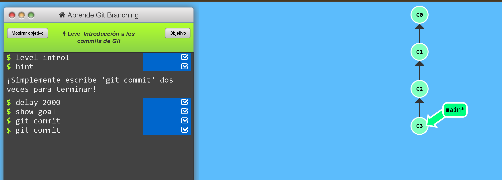

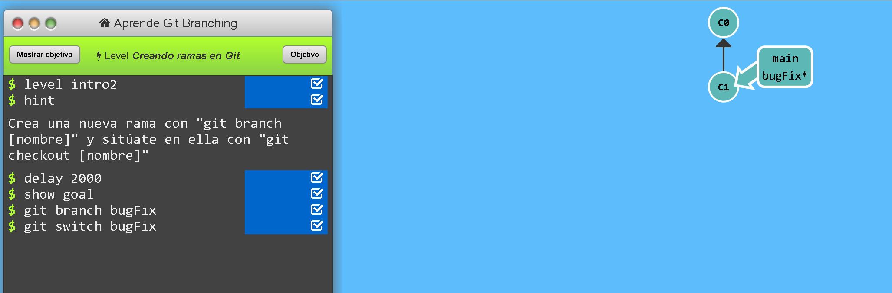

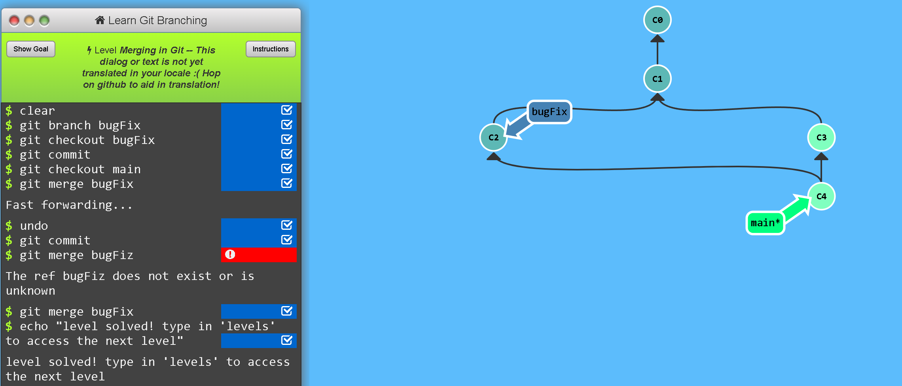

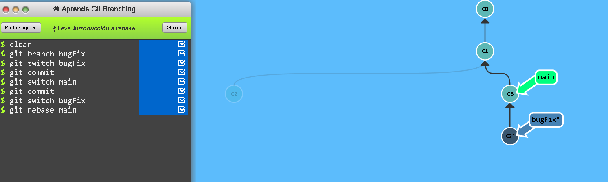

## PUNTO 2

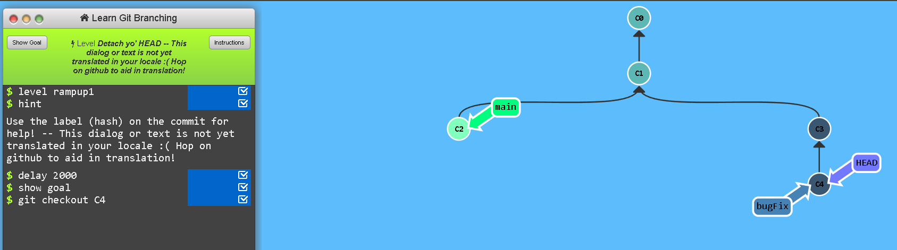

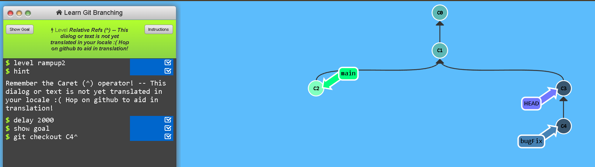

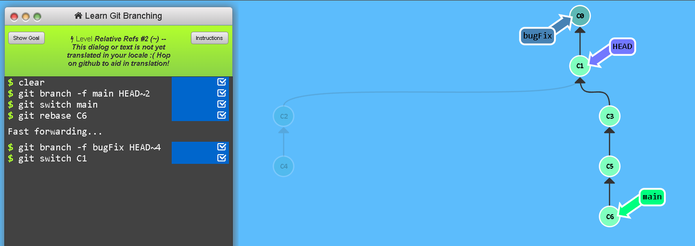

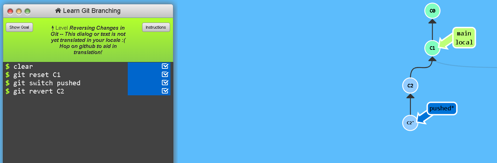

## PUNTO 3

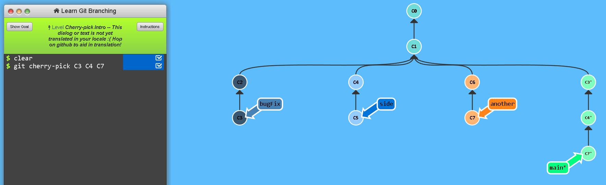

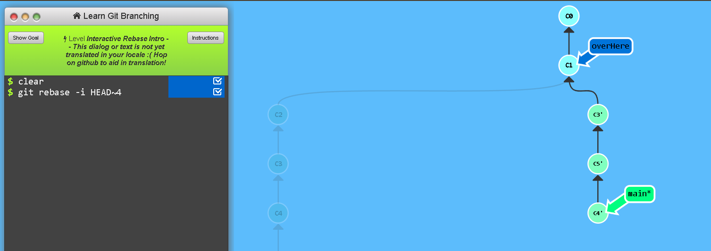

## PUNTO 4

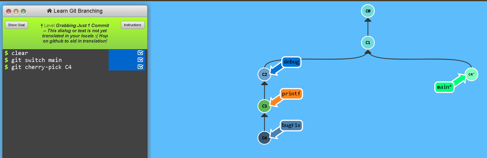

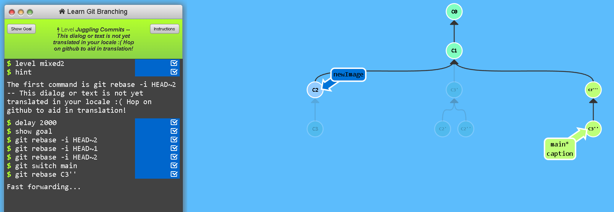

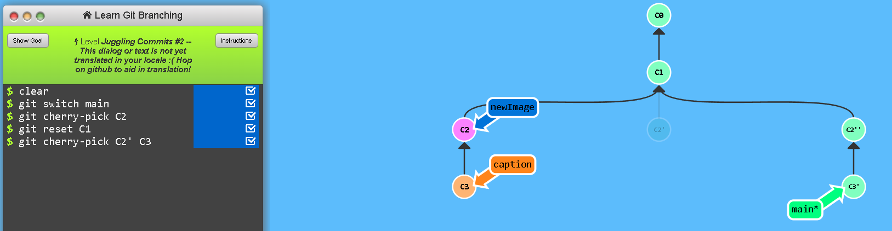

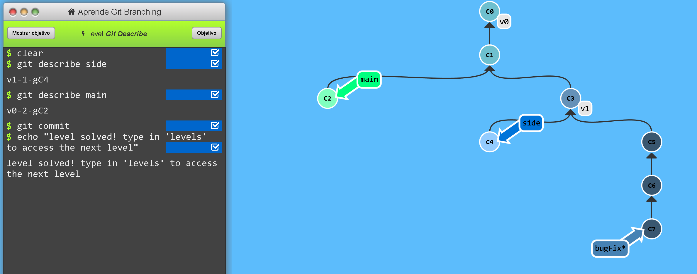

## PUNTO 5

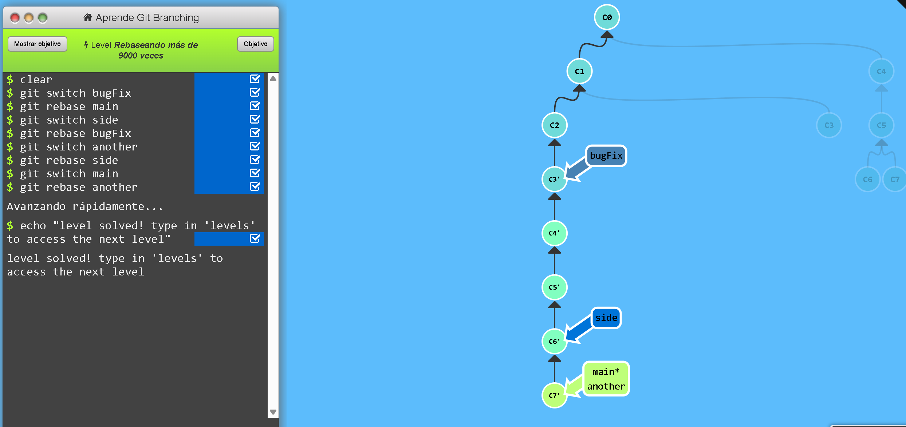

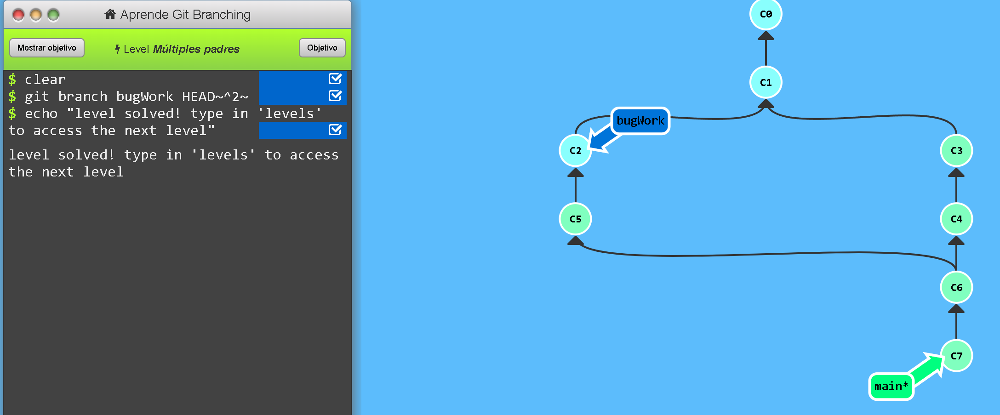

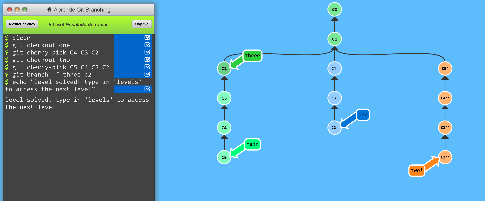

---

# REMOTE

## PUNTO 1

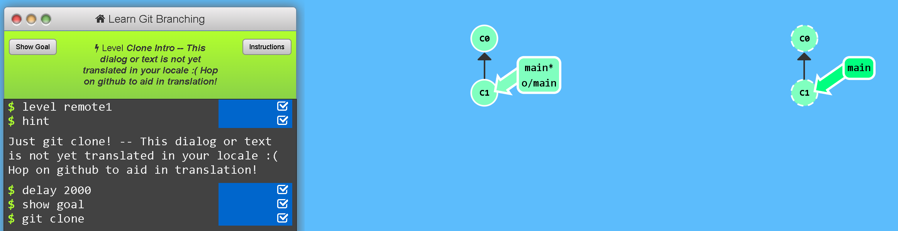

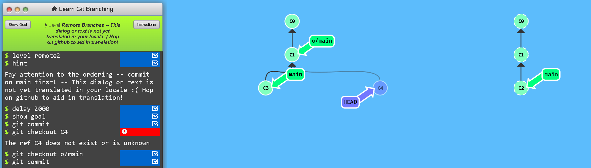